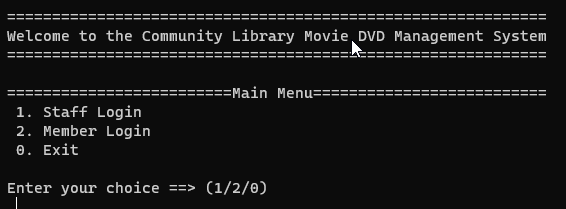
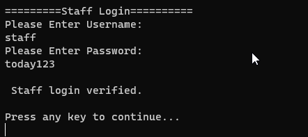
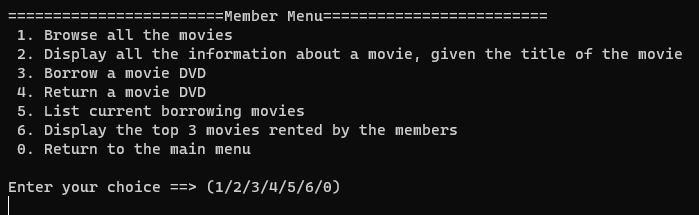
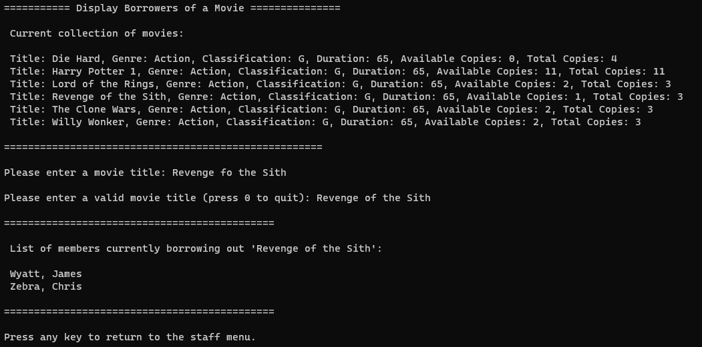

.NET 5.0 Runtime (v5.0.17):
https://download.visualstudio.microsoft.com/download/pr/a0832b5a-6900-442b-af79-6ffddddd6ba4/e2df0b25dd851ee0b38a86947dd0e42e/dotnet-runtime-5.0.17-win-x64.exe

1. Open CAB301Project1.sln in Visual Studio Code.
2. Run `Start Debugging`

## Demo Images
   
   
   
   

Development of a Software Application for a Community Library to Manage Its Movie DVDs
#### Functionality
##### Staff Menu
1. Add new DVDs of a new movie to the system 
2. Remove DVDs of a movie from the system
3. Register a new Member with the system
4. Remove a registered member from the system 
5. Display a member's contact phone number, given the member's name
6. Display all numbers who are currently renting a particular movie

##### Member Menu
1. Add new DVDs of a new movie to the system 
2. Remove DVDs of a movie from the system
3. Register a new Member with the system
4. Remove a registered member from the system 
5. Display a member's contact phone number, given the member's name
6. Display all numbers who are currently renting a particular movie

### Version Log
Version 1.0 
- Added code from Phase 1:
- IMember
- IMemberCollections 
- Member
- MemberCollections
- Program.cs (used for testing)

Version 1.1
- Added code from Phase 2:
- IMovie
- IMovieCollections
- Movie
- MovieCollections
- Added UserInterface class
- added a few methods in there and linked the menus up to not crash

Version 1.2
- Added/tested and completed all methods in UserInterface.cs (1400 lines)
- Final checks and testing

Version 1.3
- Added Report 
- Final clean up
